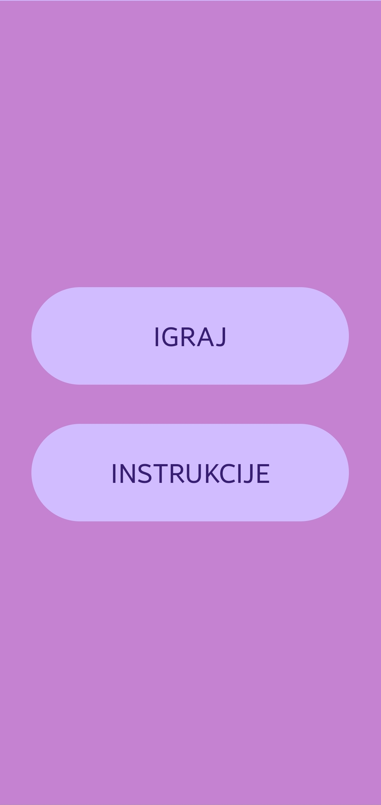
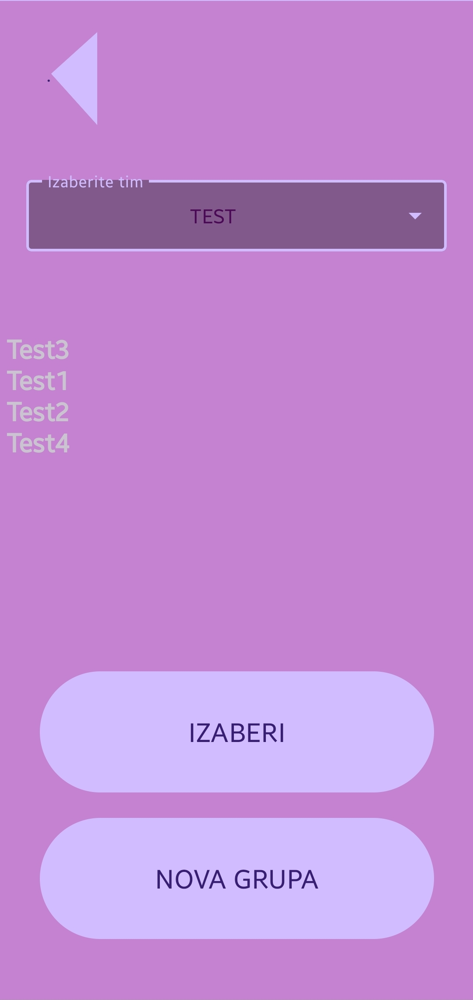
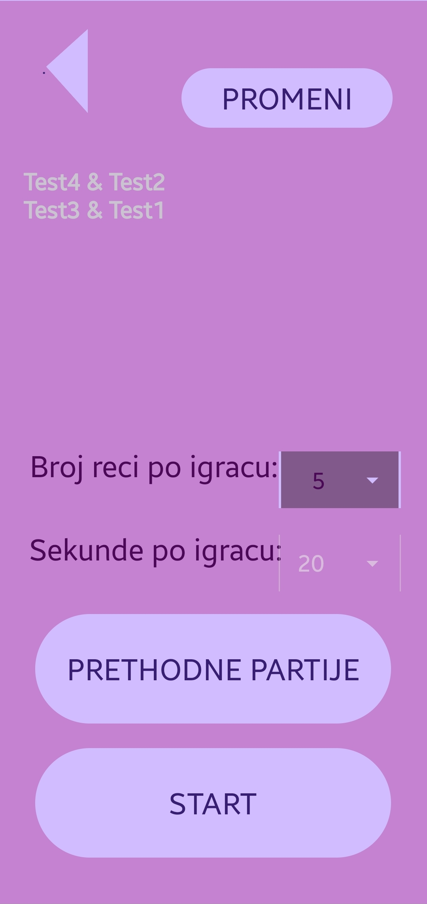
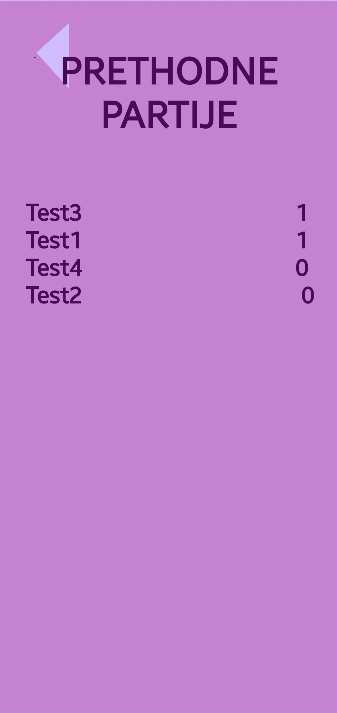
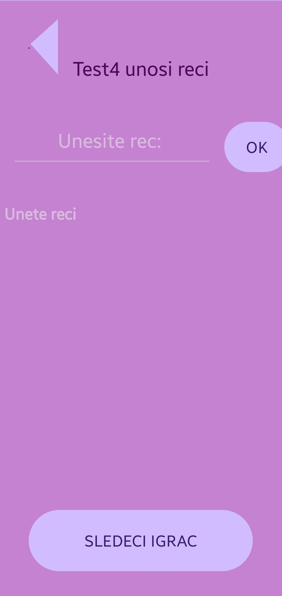
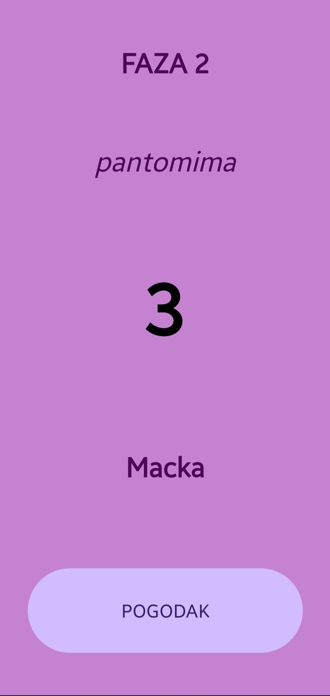
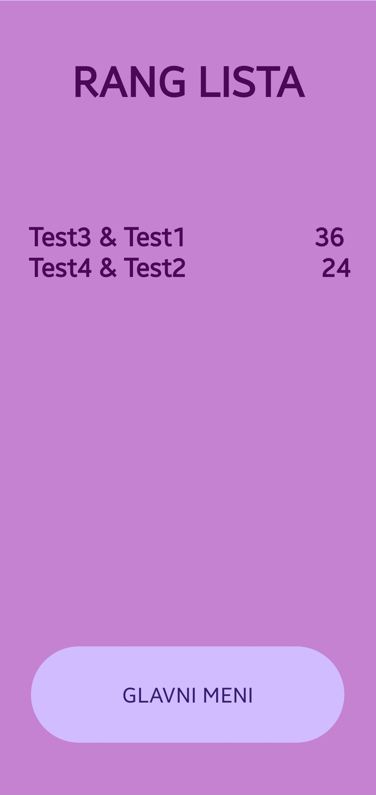

# 2023_Asocijacije

# O aplikaciji

Android aplikacija za igranje igre "Asocijacije u 3 faze"

## Korišćene tehonologije

Aplikacija je rađena u programskom jeziku [Kotlin](https://kotlinlang.org/), u okruženju [Android Studio](https://developer.android.com/studio).

## Opis igre

**Postavka igre**

Unesite ime koje želite da nosi Vaša grupa. Zatim unesite broj igrača koji Vaša grupa sadrži (mora da bude paran broj). Unesite imena članova grupe i zatim na početnom meniju izaberite ime Vaše grupe. Parovi su nasumično izabrani, ali imate slobodu da to promenite. Kada izaberete broj reči po igraču i broj sekundi za pogađanje, spremni ste za igru!

**Unos reči**

Na ekranu piše koji igrač unosi reči. Kada završi, daje telefon igraču čije ime piše na ekranu. Tek kada su svi igrači uneli reči, na ekranu će pisati koji igrač započinje igru.

**Faze**

Faze se menjaju kada se objasne svi pojmovi.

*Prva faza (Slobodno objašnjavanje)* - Igrač koji objašnjava može da priča partneru koliko god hoće o pojmu na ekranu.

*Druga faza (Jedna reč)* - Igrač koji objašnjava sme da iskoristi samo jednu reč prilikom objašnjavanja nakon čega ne izgovara ništa dok partner ne pogodi pojam.

*Treća faza (Pantomima)* - Igrač koji objašnjava pantomimom pokušava da objasni partneru dati pojam.

**Kraj igre**

Nakon treće faze, pogođene reči se sabiraju po parovima i pobedio je onaj par koji ima najviše pogođenih pojmova.

## Instalacija

Aplikaciju možete preuzeti [ovde](https://drive.google.com/drive/folders/1oNr7uWwlvGARSucjCQZoqWhaqXzQHBKQ).

---

## Izgled aplikacije

Početni ekran              |  Biranje grupe           | Uparivanje               | Prethodne partije     |
:-------------------------:|:-------------------------:|:-----------------------:|:----------------------: 
 |  |  | 

Unos reči                  |  Igra                     | Rang lista             |
:-------------------------:|:-------------------------:|:-----------------------: 
 |  | 

---

### Autori projekta

Vasilije Kostić - vasilije.kostic2001@gmail.com

Anja Stanić - anja.stanic2001@gmail.com

Tanja Gavrić - tanja2000gavric@gmail.com
