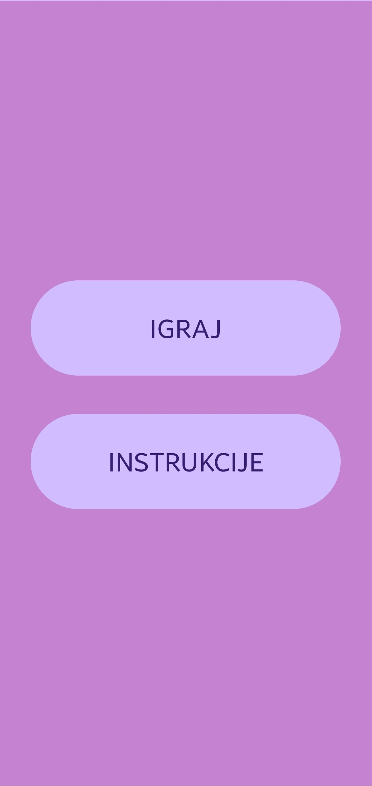
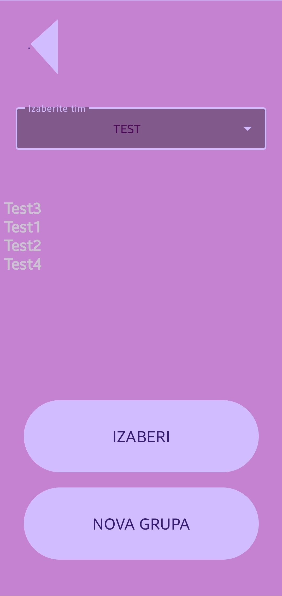
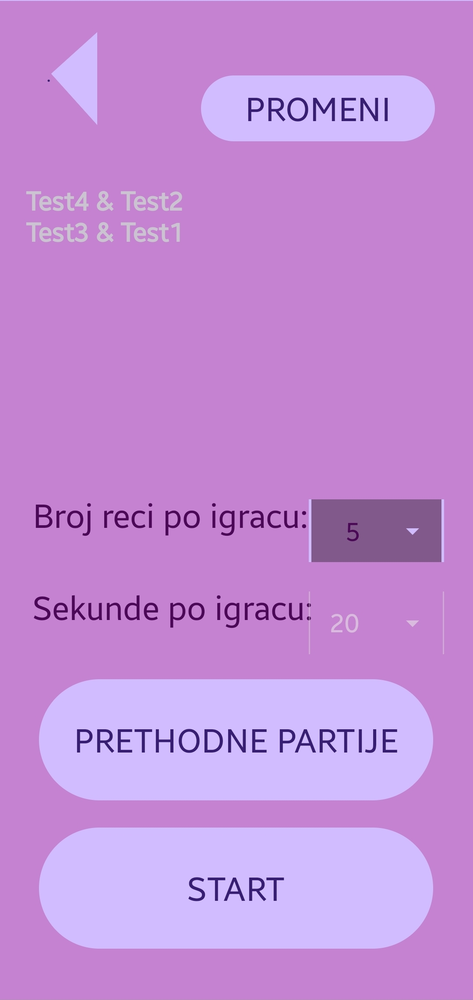
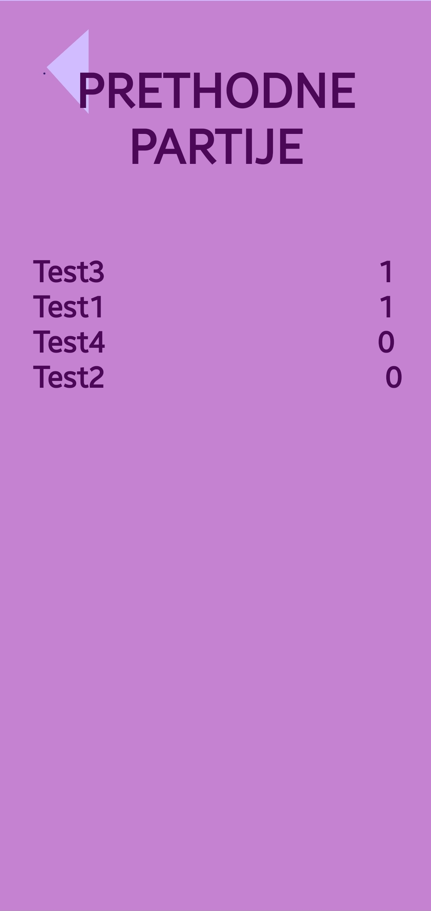
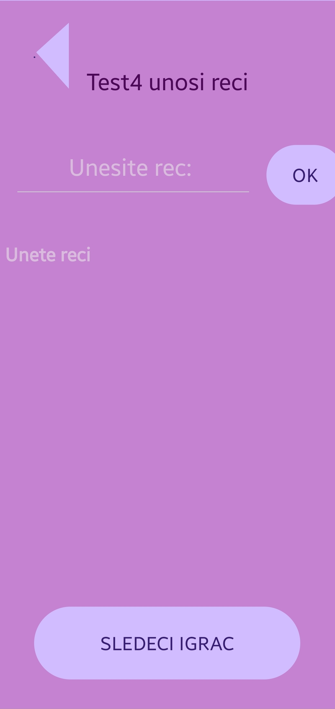
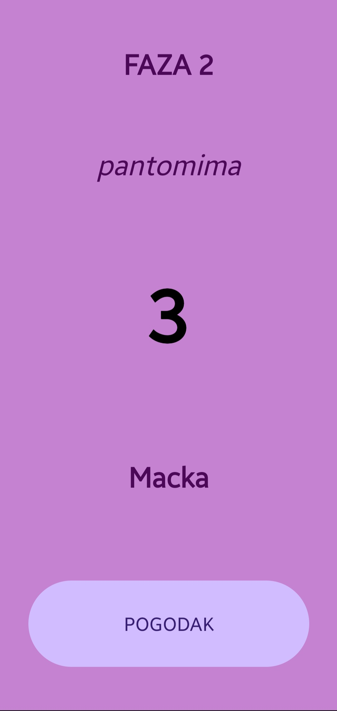
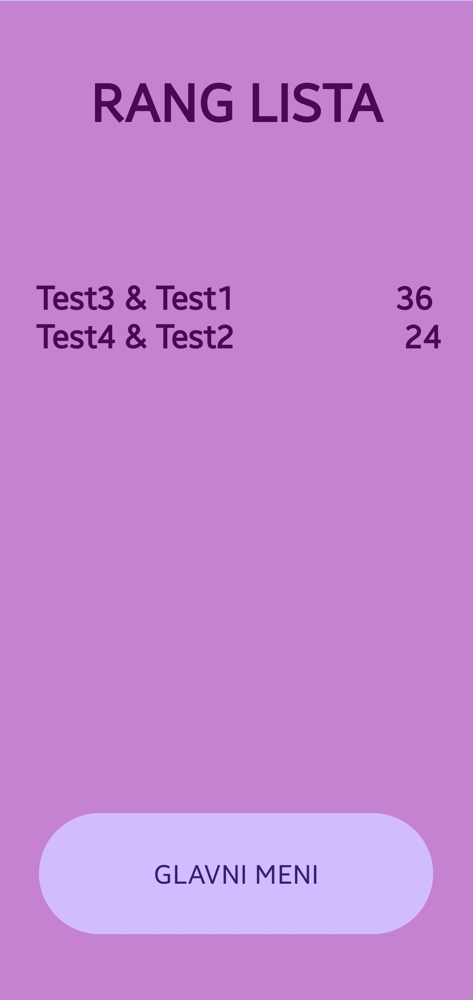

# 2023_Asocijacije

# About application

Android application to play the game "Associations in 3 phases"

## Technologies used

The application was made in programming language [Kotlin](https://kotlinlang.org/), in the environment [Android Studio](https://developer.android.com/studio).

## Game description

**Setting up the game**

Enter the name you want your group to bear. Then, enter the number of players your group contains (must be an even number). Enter the names of the group members and then select the name of your group on the home menu. Pairs are randomly selected, but you have the freedom to change it. Once you've selected the number of words per player and the number of seconds to guess, you're ready to play!

**Entering words**

It says on the screen which player is entering the words. When they are done, they hand the phone to the next player, whose name will be written on the screen. Only when all players have entered the words, the screen will show which player starts the game.

**Phases**

Phases change when all of the words are guessed.

*Phase One (Free explanation)* - The explaining player can talk to their partner as much as they want about the concept on the screen.

*Phase Two (One word)* - The explaining player may only use one word when explaining, after which he does not say anything until his partner guesses the concept on the screen.

*Phase Three (Charades)* - The explaining player tries to explain the given concept to the partner by pantomime.

**Game ending**

After the third phase, the guessed words are added up in pairs and the pair with the most guesses wins.

## Installation

You can download the application [here](https://drive.google.com/drive/folders/1oNr7uWwlvGARSucjCQZoqWhaqXzQHBKQ).

---

## Application layout

Home screen                | Selecting a group         | Pairing                 | Previous games        |
:-------------------------:|:-------------------------:|:-----------------------:|:----------------------: 
 |  |  | 

Entering words             |  Game                     | Scoreboard           |
:-------------------------:|:-------------------------:|:-----------------------: 
 |  | 

---

### Authors

Vasilije Kostić - vasilije.kostic2001@gmail.com

Anja Stanić - anja.stanic2001@gmail.com

Tanja Gavrić - tanja2000gavric@gmail.com
